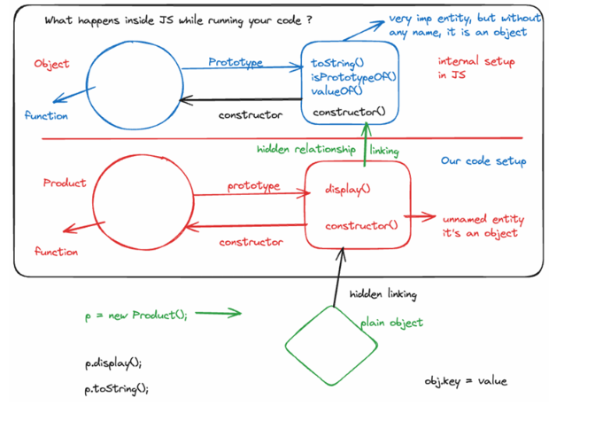
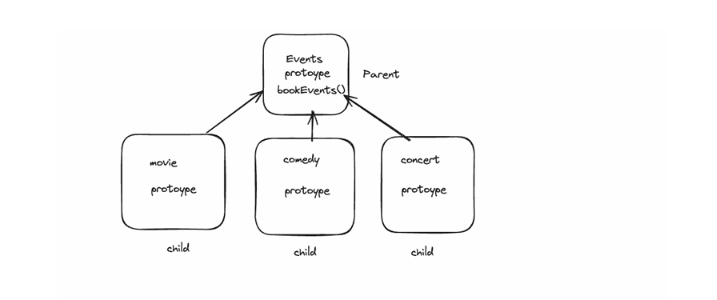
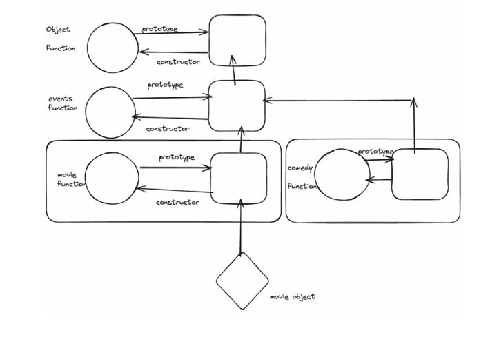

# JavaScript Prototypes:
 
---
 
## 1. Class-Based Blueprints vs. JavaScript's Live Linking
 
In traditional Object-Oriented Programming (OOP) languages like Java or C++, a **class acts as a pure blueprint**. When you instantiate an object, a complete copy of that blueprint is generated. Consequently, if you modify the class later, it does not affect any previously created objects.
 
In JavaScript, however, modifying a class or a constructor function directly alters or expands the capabilities of previously created objects. This behavior is why many developers state that **JavaScript is not strictly "object-oriented," but rather an "Object Linked to Other Objects" (OLOO) language.** The driving mechanism behind this unique behavior is the **Prototype**.
 
---
 
## 2. What is a Prototype?
 
A **Prototype** is the built-in mechanism in JavaScript that allows objects to share properties and methods with one another.
 
For example, if we create a plain object `x = {}` and call `x.toString()`, it returns `"[object Object]"`. Even though we never explicitly defined a `toString` method inside our object `x`, we can still access it. This works because JavaScript automatically looks up the method along the object's **prototype chain**.
 
---
 
## 3. The Under-the-Hood Internal Setup
 
JavaScript automatically handles a great deal of object setup behind the scenes:
 
- **The Built-in `Object` Function:** JavaScript automatically sets up a global constructor function named `Object`.
- **The Anonymous Prototype Object:** Alongside this function, JavaScript creates a special, unnamed companion object containing native implementations of fundamental methods like `toString()`, `isPrototypeOf()`, and `valueOf()`.
- **Accessing the Companion Object:** Because this companion object does not have a distinct name, it is accessed via the property: `Object.prototype`.
- **The Circular Link:** This companion object features a built-in function called a `constructor`. If you call `Object.prototype.constructor`, it points right back to the original `Object` function.
```javascript
// Accessing the companion object
console.log(Object.prototype);
// Output: {toString: ƒ, valueOf: ƒ, hasOwnProperty: ƒ, …}
 
// Accessing the constructor
console.log(Object.prototype.constructor);
// Output: ƒ Object() { [native code] }
```
 

 
> The diagram above shows what happens inside JS while running your code. The `Object` function and its companion prototype object form a circular link via `constructor`. Your custom `Product` function works the same way — its prototype object holds `display()` and `constructor()`, and a plain object created with `new Product()` links to it via a hidden `[[Prototype]]` link.
 
---
 
## 4. Custom Code Setup (Functions and Classes)
 
The exact same internal behavior occurs when we define our own functions or classes.
 
### Using a Function
 
When we create a custom function, JavaScript automatically creates a companion prototype object for it.
 
```javascript
function Product() {}
 
console.log(Product.prototype);
// Output: { constructor: ƒ Product() }
```
 
### Using a Class
 
When using ES6 classes, any methods defined inside the class are automatically assigned to that companion prototype object.
 
```javascript
class Product {
    display() {}
}
 
console.log(Product.prototype);
// Output: { display: ƒ, constructor: class Product }
```
 
Just like the native setup, `Product.prototype.constructor` points directly back to our original `Product` class or function.
 
---
 
## 5. Why `display()` Exists on `Product.prototype` and Not `p`
 
When you write a class method inside a class body, it is automatically assigned to the prototype rather than the instance:
 
```javascript
class Product {
    constructor(n) {
        this.name = n;       // Assigned directly to the instance
    }
    display() {
        console.log(this);   // Assigned to the prototype
    }
}
const p = new Product("iphone");
```
 
If you log `p`, you only see `Product {name: 'iphone'}`. The `display()` method **does not exist directly on the plain object `p`**.
 
### Why JavaScript does this: Memory Optimization
 
If you create 1,000 products, each instance gets its own unique `name` property. However, they all share a **single copy** of the `display()` function located at `Product.prototype`. This saves an enormous amount of system memory.
 
---
 
## 6. Setting Methods: Instance vs. Prototype
 
### Case A: Methods inside the constructor (Duplicated in Memory)
 
If you explicitly attach a method to `this` inside the constructor:
 
```javascript
class Product {
    constructor(n) {
        this.name = n;
        this.display = function() { console.log(this); };
    }
}
```
 
**Result:** Every single new object created will get its own separate copy of the `display` function physically attached to it. The prototype chain is **not** utilized for this method.
 
### Case B: Methods added to the Prototype (Shared in Memory)
 
If you add it outside the constructor or via a class declaration:
 
```javascript
Product.prototype.display = function() { console.log(this); };
```
 
**Result:** The method lives on `Product.prototype`. If you dynamically modify this prototype method later, **all existing instances (even older ones)** instantly execute the updated code because they share a live reference to it.
 
---
 
## 7. The Call-Site Problem and The Hidden Link (`__proto__`)
 
If you try to bypass the automatic lookup and call the method directly from the prototype entity:
 
```javascript
Product.prototype.display();
```
 
The call-site is now `Product.prototype`. Consequently, the `this` keyword inside `display()` points to the prototype object itself, **not** your instance `p`. You lose your specific instance data (`this.name` will be `undefined`).
 
To inspect the hidden link that resolves this lookup on an instance, JavaScript historically provided an accessor property:
 
### The Story of `__proto__` (Dunder Proto)
 
- **What it is:** `__proto__` is a legacy getter/setter property that exposes the internal `[[Prototype]]` link of an object.
- **Current Status in Modern JS:** While `p.__proto__` still works in browsers for compatibility reasons, it is **deprecated** because mutating an object's prototype via `__proto__` causes severe performance slowdowns in modern JS engines.
- **The Modern Standard:** To inspect or safely handle prototype links today, you should use standard methods:
  - `Object.getPrototypeOf(p)` — to read the prototype link
  - `Object.setPrototypeOf(obj, prototype)` — to change it
  - `Object.create(prototype)` — to build an object with a specific link
---
 
## 8. Prototypal Inheritance & The `extends` Keyword
 
In software engineering, inheritance allows us to share common business logic. Imagine building an application like *BookMyShow* where users can book a **Movie**, a **Comedy Show**, or a **Concert**. Instead of rewriting duplicate ticketing code three times, we consolidate the shared logic inside a parent class called `Events`.
 

 
> The diagram above shows `Events.prototype` (with `bookEvents()`) sitting as the **parent**. The `movie`, `comedy`, and `concert` prototypes are all **children** that inherit from it.
 
When you use the modern `extends` keyword in JavaScript:
 
```javascript
class Events {
    bookEvent() {
        console.log("Event booked successfully!");
    }
}
 
class Movie extends Events {
    showtime() {
        console.log("Showtime set...");
    }
}
 
const m = new Movie();
```
 
Under the hood, `extends` configures a multi-layered prototype chain by connecting the child's companion object to the parent's companion object:
 
```
m.__proto__                →  Movie.prototype
Movie.prototype.__proto__  →  Events.prototype
Events.prototype.__proto__ →  Object.prototype
```
 

 
> The diagram above shows the complete chain. The `movie object` (diamond) links up to `Movie.prototype`, which links to `Events.prototype`, which links to `Object.prototype` — all the way at the top.
 
### Walking the Chain: Executing `m.bookEvent()`
 
When you run `m.bookEvent()`:
 
1. JS checks the local object `m`. **(Not found)**
2. JS moves up the hidden link to check **`Movie.prototype`**. **(Not found)**
3. JS moves up another level to check **`Events.prototype`**. **(Found!)** The method executes seamlessly while ensuring `this` correctly points back to your specific movie instance `m`.
4. If it weren't there, it would check **`Object.prototype`**, and finally stop at `null` (returning `undefined`).